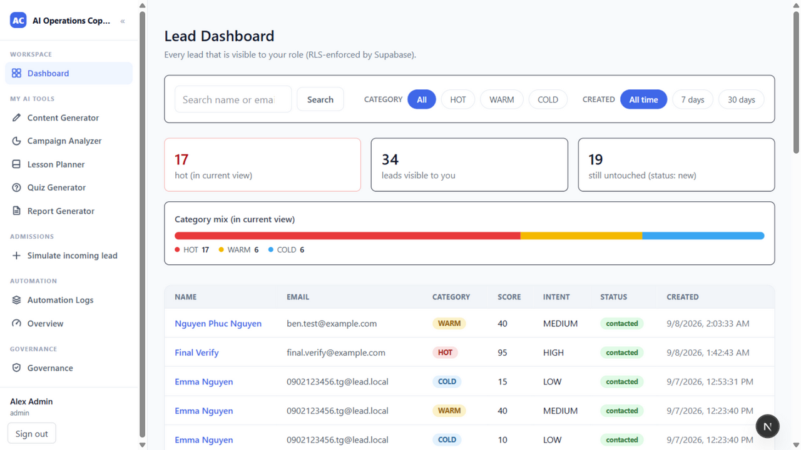

# AI Operations Copilot

An **AI operations copilot** for a simulated Vietnamese education center: governed lead automation, an approval-gated assistant, and role-scoped dashboards — built to demonstrate *controlled* AI automation, not autonomous behavior.

**Status (2026-09-20):** the full governance chain works end-to-end — **AI recommends → human approves → system executes → audit trail proves it.** Email dispatch runs via Brevo when configured (honest simulated dispatch when not). 344 unit tests across 29 files, typecheck, ESLint and the guarded production build all pass. Migrations 001–022 applied on the hosted Supabase project; remote CI green on `main`.



## What it does

- **Operations command center** — the dashboard answers *"what needs my attention right now?"*: operational KPIs (needs action / follow-ups due / at risk / total / pending approvals), a ranked Priority Actions queue (overdue follow-up → unactioned HOT → score), and the AI's recommended action inline in every table row. All metrics come from one shared snapshot module shared with the briefing, so surfaces can never drift.
- **Approval gate with execution** — Lead Detail is a decision workspace: AI Assessment + Recommended Action with **Approve / Edit / Reject**. Approving an email draft dispatches it (Brevo HTTP API when configured; audited `sent_simulated` when not — double-click races lose the claim). Approving an action creates the follow-up task. Every decision is an append-only audit record.
- **Ask X — the governed assistant** — a floating bubble on every page plus a full Mission Control workspace at `/agent`: session history, rich lead/task/knowledge/email cards, run inspector, clarification-before-action for ambiguous requests, and a **proactive morning briefing** computed by SQL (zero model calls) — pinned as today's ☀ Briefing session, auto-generated on first open of the day.
- **Classic admissions pipeline** — Telegram or web intake → signed n8n webhook → AI qualification → CRM → email draft → counselor task → run logs. Deterministic, inspectable, dry-run by default.
- **Governance** — role-scoped RLS everywhere (counselor sees assigned leads, ops/admin all, marketing/teacher none), per-tool enable flags, a kill switch, an agent approvals inbox with self-approval forbidden, and scope-restricted machine clients (`agent.run`, `briefing.generate`).

## Architecture at a glance

```text
Staff browser → Next.js 15 → Supabase (Auth + RLS)
                 ├→ dashboards / decision workspace (shared ops snapshot)
                 ├→ Ask X: governed agent runtime → tools → Gemini
                 │    └─ approvals inbox · morning briefing (SQL, zero tokens)
                 └→ approvals execute: Brevo dispatch · task creation
n8n: fixed admissions pipeline · Telegram parent chatbot · daily briefing cron
External machine clients → scoped API (agent.run | briefing.generate)
```

Next.js 15, React 19, TypeScript, Tailwind v4, Supabase/Postgres (RLS everywhere), n8n, Gemini. Email via Brevo HTTP API (no SMTP dependency).

## Run locally

Node 22+, npm. Credentials live in `.env` (never committed) — see `.env.example` for every variable including Brevo dispatch.

```sh
npm install
npm run dev          # app at http://localhost:3000 (predev warns about port conflicts / stale builds)
npm run n8n          # optional: classic pipeline + briefing cron
npm run bot          # optional: Telegram parent chatbot
```

Migrations 001–021 are in `supabase/migrations/` and are applied to the configured Supabase project. Brevo email dispatch is optional: set `BREVO_API_KEY` + `BREVO_FROM_EMAIL` for real sends; without them approvals record honest simulated dispatches.

## Verify

```sh
npm run lint
npm run typecheck -- --incremental false
npm test             # unit suites (334 tests / 30 files)
npm run build        # guarded: refuses while `npm run dev` is up (BUILD_ANYWAY=1 builds an isolated .next-build)
npm run ci           # latest GitHub Actions status for the current branch
```

## Documentation

| Doc | Contents |
|---|---|
| [PRODUCT_SPEC](docs/PRODUCT_SPEC.md) | Product contract and scope |
| [ARCHITECTURE](docs/ARCHITECTURE.md) | System map, data flow, module boundaries |
| [AGENT_CORE](docs/AGENT_CORE.md) | Agent runtime, tools, guards, briefing |
| [SECURITY](docs/SECURITY.md) | Trust model, RLS, scopes, dispatch security |
| [FEATURES](docs/FEATURES.md) | Feature inventory |
| [RUNBOOK](docs/RUNBOOK.md) | Operations: services, migrations, Brevo, troubleshooting |
| [TESTING](docs/TESTING.md) | Test suites and what they pin |
| [SITUATION_OCCUR](docs/SITUATION_OCCUR.md) | Honest log of user questions, decisions and incidents |
| [TELEGRAM-CHATBOT](docs/TELEGRAM-CHATBOT.md) · [WORKFLOW](docs/WORKFLOW.md) · [EXTERNAL_API](docs/EXTERNAL_API.md) | Bot, n8n workflows, machine API |

*Not production-hardened: single-tenant demo scope, simulated email default, no remote CI. The point is the governance design, and it is real.*
