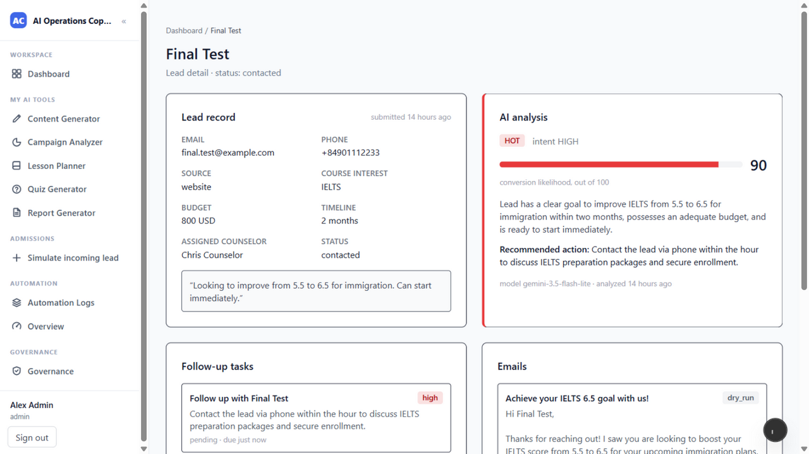
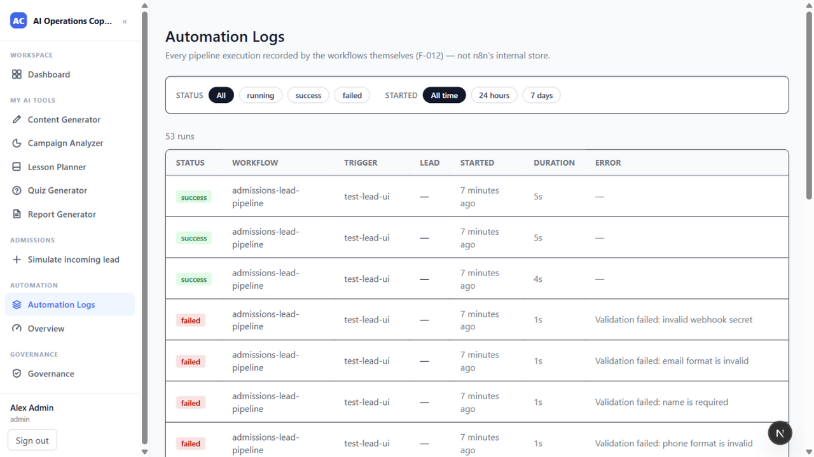
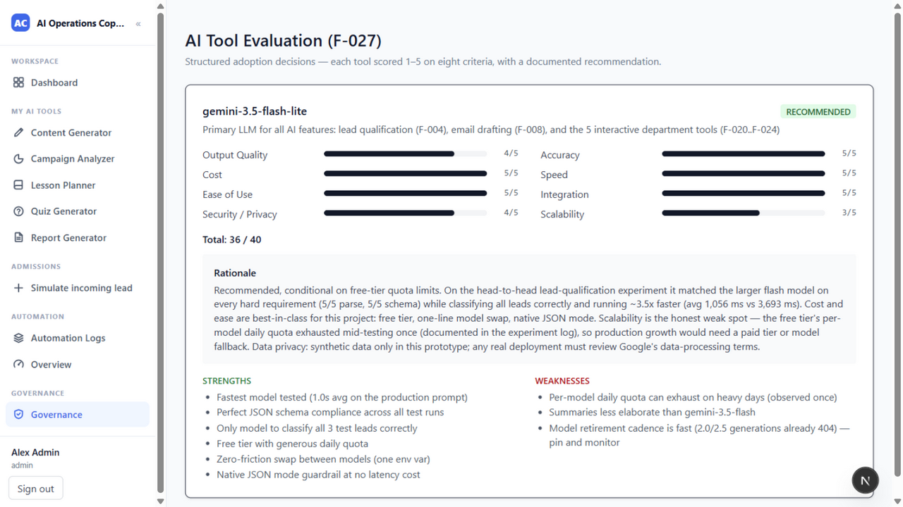
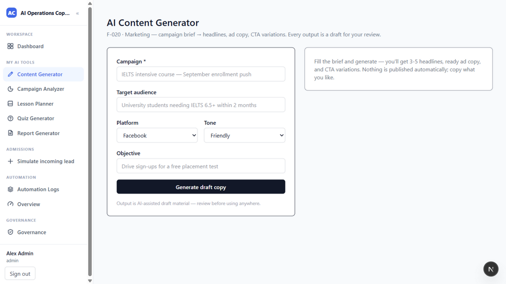

# AI Operations Copilot

A portfolio prototype for a **simulated Vietnamese education company**: admissions automation, staff AI drafting tools, role-scoped dashboards, governance materials, and a governed tool-using agent runtime.

**Status (revision, 2026-09-19):** all previously uncommitted work is committed in logical chunks; classic workflows, agent hardening and both MCP profiles remain implemented with offline verification. **280/280 unit tests across 24 files, typecheck, lint (ESLint 9, all findings fixed), build and validation of 4 n8n workflows pass — rerun firsthand on the committed revision** (3 existing Gmail variable warnings). **28/28 isolated SQL checks** were previously recorded with `PGLITE_MODULE_PATH` set for temporary dependencies. Hosted migration 015, real multi-connection concurrency, live MCP/other integrations, remote CI and new captures remain pending. This is not production-ready or a completed customer deployment. See the [execution report](docs/EXECUTION_REPORT.md) and its [2026-09-19 addendum](docs/EXECUTION_REPORT.md#7-addendum--2026-09-19-revision-and-firsthand-re-verification), [local evidence](docs/evidence/LOCAL_VERIFICATION.md) and [remaining gates](docs/ROADMAP.md).


## What it demonstrates

- **Classic admissions pipeline:** internal test-lead form or Telegram intake → signed n8n webhook → validation → AI qualification → deterministic category thresholds → CRM → email draft → dry-run email record → counselor task and notification → run logs. A separate Gmail send path exists but is outside the local demonstration target.
- **Staff application:** lead and automation dashboards plus five human-reviewed tools: Content Generator, Campaign Analyzer, Lesson Planner, Quiz Generator, and Report Generator.
- **Agent core / Ask X:** a model selects registered tools; application code checks permissions, resources, arguments and policy, records execution, and supports approval suspension, knowledge retrieval and bounded delegation. This is separate from n8n's fixed pipeline.
- **Governance:** historical tool experiments and adoption decisions, designed training and SOPs. Training delivery and real employee adoption are not claimed.
- **External integration code:** credential-scoped REST, a signed lead webhook, an [MCP stdio adapter](mcp/README.md) and [native n8n MCP tools](docs/WORKFLOW.md#5-mcp-profile-1-native-n8n-admissions-tools). MCP is implemented and offline-verified, not live-accepted or deployed; these integrations do not provide tenant isolation or a live Facebook/Zalo connection.

[Feature inventory](docs/FEATURES.md) · [Agent core](docs/AGENT_CORE.md) · [External API](docs/EXTERNAL_API.md)

## Architecture at a glance

```text
Staff browser → Next.js → Supabase Auth / RLS-backed dashboards
                    ├→ interactive AI tools → optional Gateway / direct Gemini
                    ├→ governed agent runtime → tools / Supabase / direct Gemini
                    └→ signed admissions webhook → n8n fixed pipeline
Telegram → local tunnel → n8n chatbot → admissions pipeline
Signed external lead webhook → Next.js → CRM + agent triage
External API client → Next.js → capability-scoped agent runtime
```

Next.js 15, React 19, TypeScript, Tailwind v4, Supabase/Postgres, n8n, Gemini and optional Gmail transport. Gateway routing applies to `generateJSON`, **not every AI call**. PromptLedger can own selected prompts; receiving telemetry does not make it the owner of all prompts. See [architecture](docs/ARCHITECTURE.md), [AI design](docs/AI_DESIGN.md), and [security boundaries](docs/SECURITY.md).

## Run locally

Use Node 22 and npm. Configure credentials privately; never paste them into docs or issue reports. Follow [RUNBOOK](docs/RUNBOOK.md) for migrations, synthetic seed data and safety checks before starting services.

```sh
npm install
npm run dev
```

The app is intended at `http://localhost:3000`. The agent core does not require n8n. For the classic pipeline use `npm run n8n`; for the Telegram demo use `npm run bot` after the [bot setup](docs/TELEGRAM-CHATBOT.md). Local services plus a temporary tunnel are the demonstration target, not a hosted production deployment.

## Verify

```sh
npm run lint
npm run typecheck -- --incremental false
npm test
```

Live AI, database, Playwright and workflow checks require separate preparation and may create records, spend quota or send Telegram messages. Commands and evidence rules are in [TESTING](docs/TESTING.md); the test total above is a dated working-tree checkpoint, not a fixed expectation or current green-CI claim.

## Evidence and limitations

- [Simulated school case study](docs/case-study/README.md): assumed discovery, local deployment plan, and an explicitly unmeasured results framework; no fabricated interviews, users, ROI or outcomes.
- [Tool Lab](docs/AI_TOOL_LAB.md) and [Tool Evaluation](docs/AI_TOOL_EVALUATION.md): retained historical experiments, not a fresh benchmark.
- `prepare_email` **only records a dry-run draft**, even when approval is required. It does not send Gmail messages.
- External agent reads use a service client; restricting tools and client-owned run history does not isolate CRM data by tenant.
- Postgres limiter/cache implementations exist, with memory alternatives and degraded-mode behavior; durable rows alone do not provide a worker queue, exactly-once execution or automatic recovery.
- Approval resume now uses authoritative requester reads, durable at-most-once claims and guard rechecks; uncertain effects require reconciliation, not blind replay. Migration 015 is unapplied. Server approval requirements and requester opt-in are now combined with OR, persisted, retained/strengthened on resume and inherited by children. Live SQL acceptance and the background webhook lifecycle remain separate gates.
- Ask X supports manual **Refresh run trace** after approval; it does not auto-poll. The school case study is a planned skeleton, with services absent for the exercise; implemented/offline-verified MCP profiles do not establish live acceptance or customer deployment.

## Historical screenshots and demos

These existing assets are retained as historical demonstrations, not evidence of the current checkout or a real school deployment.

| Lead detail | Automation logs |
|---|---|
|  |  |

| Tool evaluation | Content generator |
|---|---|
|  |  |

[Lead pipeline video](https://youtu.be/f44MgJeGtNw) · [Telegram chatbot video](https://youtu.be/f44MgIc-8d4)

## Documentation

| Purpose | Document |
|---|---|
| Current remaining work | [Roadmap](docs/ROADMAP.md) |
| System boundaries and components | [Architecture](docs/ARCHITECTURE.md) |
| Runtime, tools, approvals, retrieval | [Agent core](docs/AGENT_CORE.md) |
| Setup and operations | [Runbook](docs/RUNBOOK.md) |
| Security limitations | [Security](docs/SECURITY.md) |
| Checks and evidence | [Testing](docs/TESTING.md) · [Local verification](docs/evidence/LOCAL_VERIFICATION.md) · [Execution report](docs/EXECUTION_REPORT.md) |
| Workflow details | [Workflows](docs/WORKFLOW.md) · [Telegram](docs/TELEGRAM-CHATBOT.md) |
| AI routing and prompt ownership | [AI design](docs/AI_DESIGN.md) |
| Integration contracts | [External API](docs/EXTERNAL_API.md) |
| Scope and governance | [Features](docs/FEATURES.md) · [Historical product assumptions](docs/PRODUCT_SPEC.md) · [Training](docs/TRAINING.md) |
| Historical plans | [Roadmap history](docs/archive/ROADMAP_HISTORY.md) · [Original Phase 9 specification](docs/archive/PHASE_9_AGENTIC_CORE_UPGRADE.md) |

Archived completion statements describe their original reporting context, not current acceptance. Private working notes are not required to follow this documentation.
