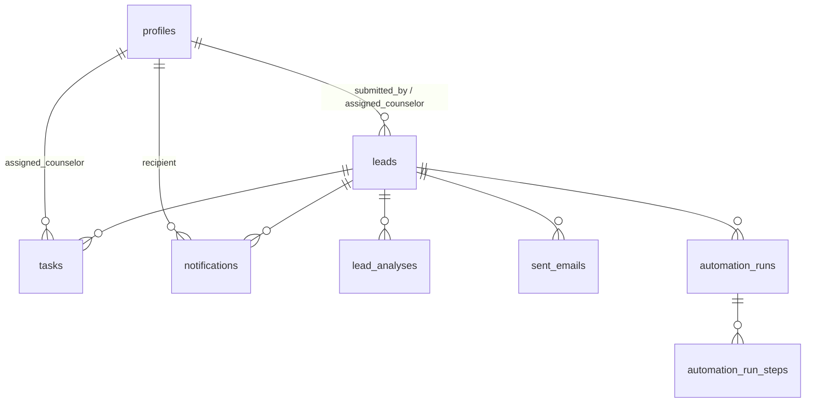

# Phase 2 Runbook — Database / CRM

Everything in this project is already generated. This page lists the **manual steps only you can do** (they happen inside your Supabase account), in order. Total time: ~15 minutes.

---

## Your steps (in order)

### 1. Create the Supabase project (~3 min)
1. Go to https://supabase.com/dashboard → **New project**
2. Name: `ai-operations-copilot` · pick the region closest to you
3. Choose a database password and save it somewhere (you won't need it often)
4. Wait ~2 minutes for provisioning

### 2. Run the SQL files (~4 min)
Dashboard → **SQL Editor** → *New query* → paste the **entire contents** of each file below → **Run**, one at a time, in this exact order:

| Order | File | What it does |
|---|---|---|
| 1 | `supabase/migrations/001_schema.sql` | Creates 9 tables, enums, keys, indexes, triggers |
| 2 | `supabase/migrations/002_rls.sql` | Enables Row-Level Security + all policies |
| 3 | `supabase/seed.sql` | Seeds courses, 8 fake leads, analyses, tasks, emails, 2 automation runs |

Each run should report "Success". (The SQL Editor runs as `postgres`, which bypasses RLS — that's expected and fine for setup.)

### 3. Fill in `.env` (~2 min)
1. Dashboard → **Project Settings → API**
2. Copy three values into `.env` (copy `.env.example` to `.env` first):
   - `Project URL` → `NEXT_PUBLIC_SUPABASE_URL`
   - `anon public` key → `NEXT_PUBLIC_SUPABASE_ANON_KEY`
   - `service_role` key → `SUPABASE_SERVICE_ROLE_KEY` ⚠️ **never expose this one to the browser or commit it**

### 4. Install dependencies (already done if I ran it for you)
```bash
npm install
```

### 5. Create the 5 demo users (~1 min)
```bash
npm run seed:users
```
Creates `admin@ / marketing@ / counselor@ / teacher@ / operations@demo.dev` — password `demo1234` — each with its role in `app_metadata` (what RLS reads). Profiles are created automatically by a database trigger.

### 6. Run the post-seed SQL (~1 min)
SQL Editor again → paste `supabase/post_seed.sql` → **Run**.
This assigns the counselor to the seeded leads/tasks and creates their notifications.

### 7. Start the app and verify
```bash
npm run dev
```
Open http://localhost:3000 and log in as each demo account (password `demo1234`).

---

## Verification matrix (what you should see)

| Login | Leads visible | Automation runs | Notifications |
|---|---|---|---|
| `counselor@demo.dev` | **5** (only assigned) | blocked (—) | 5 |
| `admin@demo.dev` | **8** (all) | **2** (1 success, 1 failed) | 0 |
| `operations@demo.dev` | **8** (all) | **2** | 0 |
| `marketing@demo.dev` | **0** | blocked | 0 |
| `teacher@demo.dev` | **0** | blocked | 0 |

API check (optional): with the app running and logged in as counselor, visit http://localhost:3000/api/leads — same 5 rows.

---

## Troubleshooting

- **"Role not applied" after re-running seed script** — log out and back in; the role lives in the JWT, which is issued at login.
- **`relation "profiles" already exists`** — you ran `001_schema.sql` twice. Either skip it (already applied) or drop the schema first.
- **RLS error when inserting a lead** — means the JWT has no role; confirm step 5 printed `role "..."` and re-login.
- **Script says "Missing NEXT_PUBLIC_SUPABASE_URL"** — `.env` file must sit in the project root, next to `package.json`.

---

## Schema reference

| Table | Purpose | Feature |
|---|---|---|
| `profiles` | Staff identity + role mirror (auto-created from auth) | F-015/016 |
| `courses` | Seeded catalog (IELTS, TOEFL, Business English) | Assumption 2 |
| `leads` | Lead records + status + assignment | F-001, F-007 |
| `lead_analyses` | AI output contract rows (score/category/intent/...) | F-004/005/006 |
| `tasks` | Follow-up tasks assigned to counselors | F-010 |
| `sent_emails` | First-touch email records incl. `dry_run` | F-009 |
| `notifications` | In-app counselor notifications | F-011 |
| `automation_runs` | One row per pipeline execution | F-012 |
| `automation_run_steps` | One row per pipeline step (F-003…F-011) | F-012 |

Deferred to Phase 7: `tool_experiments`, `tool_evaluations` (F-026/F-027).



## n8n connection (Phase 3 preview)

Phase 2's roadmap line "connect n8n to Supabase" becomes meaningful in Phase 3, when the workflow exists. There you'll add a Supabase credential in n8n (URL + `service_role` key) — it bypasses RLS by design and every write carries `created_by = 'n8n-pipeline'` attribution (AD-9).
