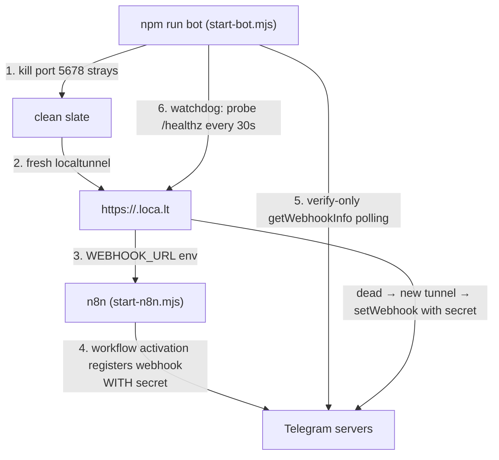

# Incident post-mortem — Telegram bot + n8n startup (2026-09-07)

One working day lost to a chain of five stacked problems. This document records
each layer, its symptom, its root cause, and the final architecture, so the
next session does not re-debug any of it.

## Timeline (symptoms in the order they appeared)

| # | Symptom | Root cause | Status |
|---|---|---|---|
| 1 | Every workflow activation of the Telegram trigger failed: `Bad request – please check your parameters`, endless retries | Project n8n was upgraded to 2.8.4. n8n 2.x **removed the `--tunnel` option** (silently ignored), so n8n registered `http://localhost:5678/...` as the Telegram webhook. Telegram rejects non-public HTTP URLs with exactly that error. | Fixed: external tunnel + `WEBHOOK_URL` env (`scripts/start-n8n.mjs`) |
| 2 | `Fire admissions pipeline` node failed: `The connection cannot be established… incorrect host (domain) value` | `.env` `N8N_WEBHOOK_URL` still pointed at a dead cloudflare quick-tunnel from an earlier session (R-09 in `WEAK_POINTS_AND_RISKS.md`). | Fixed: pinned to `http://localhost:5678/webhook/admissions-lead` (also enforced in `start-n8n.mjs`) |
| 3 | `502 Bad Gateway` on the tunnel URL; later `408`/dead tunnel even though n8n was healthy | localtunnel's fixed subdomain (`aileads-dev.loca.lt`) became a zombie on the relay; free random-URL tunnels also die mid-session. | Mitigated: fresh random tunnel each start + 30s watchdog that heals automatically |
| 4 | `The service is receiving too many requests from you` during activation | Telegram **429 rate limit** after dozens of `setWebhook`/`getWebhookInfo` calls from repeated restart cycles all day. | Mitigated: launcher makes far fewer Telegram calls, with 429 backoff |
| 5 | Bot silent even when the stack looked green; n8n shows **no execution at all** for sent messages | **Webhook registration race + secret mismatch.** n8n's Telegram Trigger registers the webhook with a secret token and rejects (`403 "Provided secret is not valid"`, no execution recorded) any delivery without it. The launcher's early `setWebhook` (no secret) could overwrite n8n's secret-protected registration depending on which landed last. | Fixed: launcher never registers at startup (verify-only); watchdog re-registers **with** the correct secret |

## The webhook secret mechanism (root cause #5 explained)

From n8n source (`TelegramTrigger.node.js` / `GenericFunctions.getSecretToken`):

- Secret = `<workflowId>_<triggerNodeId>` sanitized to `[A-Za-z0-9_-]`.
  For this project: `tgch000000000001_b2000000-0000-0000-0000-000000000001`
  (workflow id from the activation log + trigger node id from
  `n8n/telegram-parent-chatbot.json`).
- n8n calls Telegram `setWebhook` **with** this `secret_token` when the
  workflow activates. Telegram then includes header
  `x-telegram-bot-api-secret-token` on every delivery.
- On each delivery the trigger compares the header with the secret
  (timing-safe compare). Mismatch → `403 {"message":"Provided secret is not
  valid"}` → **message dropped silently, no execution row**.
- Therefore: whoever calls `setWebhook` last decides whether deliveries work.
  A registration without the secret makes the bot look "online" but dead.

## Final architecture (what runs now)

Rules baked into the launcher:

1. **Only n8n registers at startup.** The launcher verifies via
   `getWebhookInfo` until the URL matches; it never calls `setWebhook` during
   startup, so it cannot clobber n8n's secret-protected registration.
2. **The watchdog re-registers with the secret.** If the tunnel dies
   mid-session, n8n's registration still points at the old URL. The watchdog
   opens a fresh tunnel and calls `setWebhook` with the same secret n8n uses —
   exactly equivalent to n8n's own registration.
3. **Telegram 429s are retried with the server's `retry_after`**, and the
   number of Telegram calls per start is minimal.

## Operational rules

- Run **one** stack: `npm run n8n` (local only, bot offline — Telegram retry
  spam in the log is expected) **or** `npm run bot` (full bot). Never both.
- `npm run kill-stack` stops n8n, tunnels, **and orphaned n8n node processes**
  before a suspicious restart.
- The bot normally lives at the **fixed** URL `https://aileads-dev.loca.lt`
  (revived after this incident with a verified-claim + automatic random-URL
  fallback if the relay goes zombie again). The startup banner is always the
  source of truth for the current URL.
- Messages sent while the bot was offline are **lost** — Telegram does not
  queue deliveries to a dead webhook. Always test with a fresh message.
- After heavy restart cycling, Telegram may 429 for a while; the launcher
  retries automatically, but give it a minute between starts.
- The `localhost:5678` editor always works in both modes; the public
  `.loca.lt` URL is for Telegram's servers only (browsers see localtunnel's
  IP-confirmation page — harmless; the editor's asset burst 502s through the
  free relay, which is why localhost is the only supported editor URL).
- Upgrade path if free-tunnel flakiness ever becomes unacceptable: a stable
  named tunnel (free ngrok or Cloudflare account) replaces the tunnel step;
  everything else stays identical.
